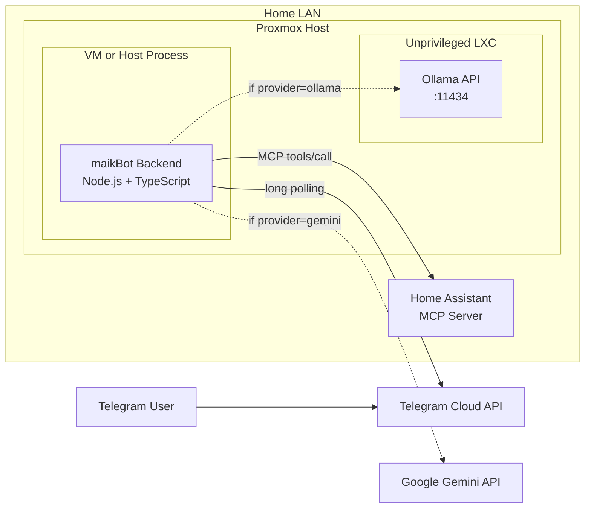
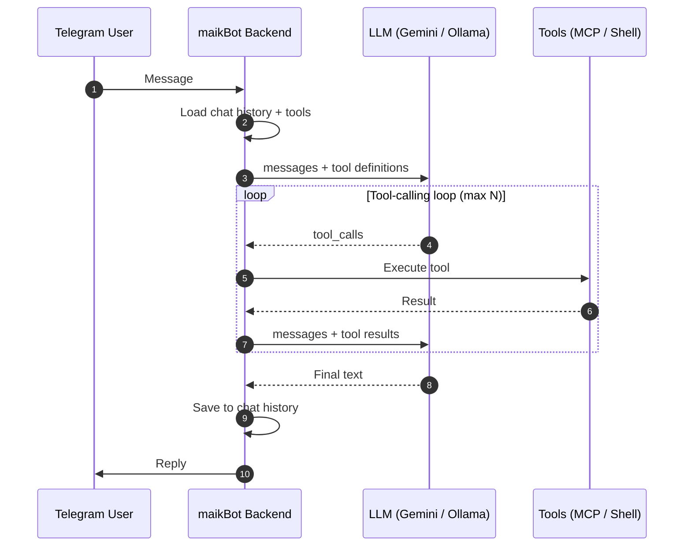

# maikBot

Local AI assistant with a security-first design:
- Telegram as chat channel via long polling (no open inbound port)
- Multi-provider LLM: **Gemini** (cloud, fast) or **Ollama** (local, private) — switchable at runtime
- MCP as an optional multi-skill tool layer (currently Home Assistant)
- Native tool calling with multi-turn error recovery
- Per-chat conversation history with automatic context management

## Architecture



### Message Flow



## Features

| Feature | Description |
|---------|-------------|
| Multi-provider LLM | Gemini (cloud) and Ollama (local), switchable via `/model` |
| Native tool calling | LLM decides autonomously when to use tools |
| Chat history | Per-chat conversation context with automatic trimming |
| MCP integration | Home Assistant devices via MCP protocol |
| Shell tool | Run arbitrary commands on the server via `shell_exec` |
| Security | Telegram allowlist, no inbound ports, MCP auth + policy |

## Telegram Commands

| Command | Description |
|---------|-------------|
| `/model` | Show current LLM provider |
| `/model gemini` | Switch to Gemini |
| `/model ollama` | Switch to Ollama |
| `/clear` | Clear chat history |
| `/status` | Show context stats (messages, tokens) |
| `/mcp tools` | List available MCP tools |

## Quick Start

```bash
cd backend
npm install
cp .env.example .env   # fill in your values
npm run dev
```

Required in `.env`:
- `TELEGRAM_BOT_TOKEN` — from @BotFather
- `GEMINI_API_KEY` — from [aistudio.google.com/apikey](https://aistudio.google.com/apikey)

See `.env.example` for all options.

## Security Principles

1. No inbound ports — Telegram long polling only.
2. Ollama stays internal (LAN only, no WAN exposure).
3. Telegram user allowlist (`ALLOWED_TELEGRAM_USER_IDS`).
4. MCP access is authenticated and policy-filtered.
5. Secrets in `.env`, never committed to git.

## Key Files

| File | Purpose |
|------|---------|
| `backend/src/core/assistant.ts` | Main orchestrator, tool-calling loop, commands |
| `backend/src/core/chat-history.ts` | Per-chat conversation history + context management |
| `backend/src/core/tool-registry.ts` | Unified registry for MCP + built-in tools |
| `backend/src/services/llm.service.ts` | LLM router (Gemini / Ollama) with runtime switching |
| `backend/src/services/gemini.service.ts` | Google Gemini API client |
| `backend/src/services/ollama.service.ts` | Ollama API client |
| `backend/src/core/tools/shell.ts` | shell_exec tool implementation |
| `backend/src/config.ts` | Environment config with Zod validation |
