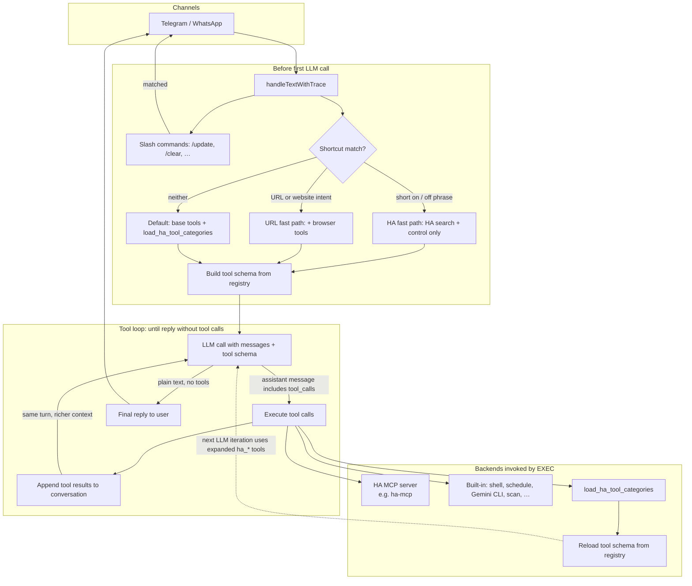

# maikBot

AI assistant via Telegram (and optional WhatsApp). LLM: Gemini, Ollama, or NVIDIA NIM. Tools: MCP for Home Assistant (e.g. community server **[ha-mcp](https://github.com/homeassistant-ai/ha-mcp)**), shell, browser, scheduling.

## Architecture

High-level request flow: the channel layer forwards text to the assistant, which runs a **tool loop** against the configured LLM. **Home Assistant** capabilities are split into a **base** set (search, state, simple control) and **on-demand** categories; the model can call `load_ha_tool_categories` mid-turn to attach more `ha_*` MCP tools before the next iteration. Built-in tools (shell, Gemini CLI, browser, schedule, scan, …) are loaded according to the same allowlist. Slash commands such as `/update` are handled **before** the tool loop.

**Routing (before the first LLM call):** two optional **fast paths** shrink the initial tool schema—**HA** = short on/off-style phrases (German/English) → only HA **search** + **control**; **URL** = link or “open website” phrasing → same base as default but **browser** tools included from the start. If neither matches, the default is base tools plus **`load_ha_tool_categories`**. All paths then enter the same tool loop.

**Tool loop:** each LLM response is either **final text** (sent to the user) or **tool calls**. The backend runs those tools, **appends the tool outputs** to the conversation as `tool` messages, and **calls the LLM again** with that longer context. After **`load_ha_tool_categories`**, the registry is **reloaded** so the **next** LLM call sees the expanded `ha_*` definitions. This repeats until the model returns text without tools.



The **HA MCP server** is not part of Home Assistant core; run it yourself. A typical setup uses [https://github.com/homeassistant-ai/ha-mcp](https://github.com/homeassistant-ai/ha-mcp).

**Modes**

| Setting | Effect |
|---------|--------|
| Default | Base tools + HA search/control + `load_ha_tool_categories` for deeper HA (automation, dashboards, history, …). Fewer MCP tools in the schema until the model loads them. |
| `LLM_HA_FAST_PATH=true` | Short on/off-style phrases start with only HA **search** + **control**; the model can still call `load_ha_tool_categories` if it needs more. |

If an old `.env` still sets `LLM_SKIP_TRIAGE`, it is **ignored**; the backend logs a one-line deprecation warning at startup.

## Tools

Every message goes through a **two-layer tool scheme**: a fixed set of tools is always available, and additional Home Assistant capability can be loaded on demand mid-turn.

### Always-loaded tools

These tools are **available from the very first LLM call**, regardless of what the user wrote:

| Category | ID | Tools |
|----------|----|-------|
| **Shell & Files** | `shell` | `shell_exec`, `shell_job_result`, `maikbot_self_update` |
| **Browser** | `browser` | `browser_navigate`, `browser_snapshot`, `browser_screenshot`, `browser_screenshot_analyze`, `browser_click`, `browser_type`, `browser_close` |
| **Vision** | `vision` | `vision_analyze_image` |
| **Reminders & Scheduling** | `schedule` | `schedule_reminder`, `schedule_daily`, `schedule_weekly`, `schedule_list`, `schedule_cancel` |
| **Gemini CLI** | `gemini_cli` | `gemini_cli_delegate`, `gemini_cli_status` |
| **Agent self-config** | `agent` | `agent_config_get`, `agent_config_set` |
| **Document scan** | `scan` | `scan_add_page`, `scan_status`, `scan_cancel` |
| **HA Search & State** | `search` | `ha_search_entities`, `ha_deep_search`, `ha_get_state`, `ha_get_states`, `ha_get_overview`, `ha_get_entity`, `ha_get_device`, `ha_list_services` |
| **HA Device Control** | `control` | `ha_call_service`, `ha_bulk_control`, `ha_get_operation_status`, `ha_get_bulk_status` |

> **Note:** The `browser` category is always declared in the schema, but actually navigating requires `BROWSER_ENABLED=true` + Playwright installed.

### On-demand Home Assistant categories

Heavier HA capabilities are **not loaded at start**. The model calls `load_ha_tool_categories` mid-turn with one or more category IDs; the tool registry is then reloaded so the next LLM iteration sees the expanded `ha_*` tools:

| Category | ID | What it adds |
|----------|----|-------------|
| **Automations & Scripts** | `automation` | `ha_config_get_automation`, `ha_config_set_automation`, `ha_config_remove_automation`, `ha_get_automation_traces`, `ha_config_get_script`, `ha_config_set_script`, `ha_config_remove_script`, `ha_get_blueprint`, `ha_import_blueprint` |
| **Configuration** | `config` | Areas, floors, groups, labels, helpers, zones, entities, integrations — 24 `ha_config_*` / `ha_*` tools |
| **Dashboards** | `dashboard` | `ha_config_get_dashboard`, `ha_config_set_dashboard`, `ha_config_delete_dashboard`, `ha_dashboard_find_card`, `ha_get_dashboard_guide`, `ha_get_card_documentation`, + resource tools |
| **History & Monitoring** | `history` | `ha_get_history`, `ha_get_statistics`, `ha_get_logbook`, `ha_get_camera_image` |
| **Calendar & Todos** | `calendar` | `ha_config_get_calendar_events`, `ha_config_set_calendar_event`, `ha_config_remove_calendar_event`, `ha_get_todo`, `ha_add_todo_item`, `ha_update_todo_item`, `ha_remove_todo_item` |
| **System & Maintenance** | `system` | `ha_get_system_health`, `ha_check_config`, `ha_restart`, `ha_reload_core`, `ha_get_updates`, `ha_get_addon`, `ha_backup_create`, `ha_backup_restore`, `ha_eval_template`, `ha_get_domain_docs`, `ha_update_device`, `ha_remove_device`, `ha_report_issue` |
| **HACS** | `hacs` | `ha_hacs_search`, `ha_hacs_info`, `ha_hacs_list_installed`, `ha_hacs_repository_info`, `ha_hacs_add_repository`, `ha_hacs_download` |

The model can pass **multiple IDs at once** to `load_ha_tool_categories` (e.g. `["automation", "config"]`).

### Fast paths

Two pattern-based shortcuts skip the default tool selection before the first LLM call:

| Fast path | Trigger condition | Initial tool set |
|-----------|------------------|-----------------|
| **HA fast path** (`LLM_HA_FAST_PATH=true`) | Short on/off-style phrase, ≤ 200 chars — e.g. *"mach das Licht an"*, *"turn off the fan"*, *"toggle kitchen lamp"* | Always-loaded + **`search`** + **`control`** only |
| **URL fast path** | Message contains a URL (`https://…`) or web keywords (*website*, *webseite*, *öffne die Seite*, …), ≤ 500 chars | Always-loaded + **`browser`** |

In all cases `load_ha_tool_categories` is available so the model can still pull in any on-demand category when it needs it.

## Quick Start

```bash
cd backend
npm install
cp .env.example .env   # fill TELEGRAM_BOT_TOKEN, ALLOWED_TELEGRAM_USER_IDS, GEMINI_API_KEY
npm run dev
```

## systemd (Debian/Ubuntu VM)

For production with auto-restart (e.g. after `/update`):

```bash
sudo ./setup-systemd.sh --install
sudo systemctl start maikbot
```

Without `--install` the script only shows the service file. Logs: `journalctl -u maikbot -f`

## Commands

| Command | Description |
|---------|-------------|
| `/model` | Show current LLM |
| `/model gemini` \| `/model ollama` \| `/model nvidia` | Switch LLM |
| `/update` | Pull updates, build, restart (needs systemd/PM2) |
| `/reload` | Build and restart only (for Gemini CLI self-improvements, no git pull) |
| `/clear` | Reset chat |
| `/status` | Context stats |
| `/mcp tools` | List MCP tools |
| `/scan` | Scan document (see Scan → Paperless below) |

## Home Assistant MCP

Home Assistant does **not** ship an official MCP server inside core. maikBot expects a **separate** MCP server that exposes Home Assistant as tools (the `ha_*` calls in the architecture diagram). That server is a **community / third-party** project you run yourself (container, add-on, or local process).

A common choice is **[homeassistant-ai/ha-mcp](https://github.com/homeassistant-ai/ha-mcp)** (unofficial; not affiliated with the core HA project). Other MCP implementations for Home Assistant exist; maikBot only needs a reachable MCP HTTP(S) endpoint and compatible tool names.

Configure the endpoint in `.env` via **`MCP_SERVERS_JSON`** (preferred) or the legacy **`HA_MCP_BASE_URL`** + **`HA_MCP_API_KEY`** pair—see `backend/.env.example`.

## Self-update & Self-improvement

Chat history is persisted to disk (`data/chat-sessions/`) and survives restarts.

**Natural language:** Ask the bot to update itself (e.g. "update dich", "aktualisiere dich") – it uses `shell_exec` for git pull, build, then tells you to run `/update` or restart.

**`/update`:** Full flow: persist chat, git pull, npm install, npm run build, exit. A process manager (systemd, PM2) restarts the bot.

**`/reload`:** Build and restart only – for local changes from Gemini CLI (avoids git pull overwriting edits).

**Self-improvement via Gemini CLI:** Ask the bot to improve itself (e.g. "verbessere dich: füge X hinzu"). It delegates to Gemini CLI with instructions to create a feature branch, make changes, commit, push, and open a PR. Never commits to main. After you merge the PR, run `/update`.

**Iterations:** When you ask to change a previous Gemini result (e.g. "change that to X"), the bot uses `continue_session=true` to resume the same Gemini CLI session.

## External repos (Git workspace)

When you ask the bot to work on an external repo (e.g. "clone X and add feature Y"), it clones into `data/repos/` and delegates to Gemini CLI with that workspace. Configure `GIT_REPOS_DIR` if needed (must be under `GEMINI_CLI_WORKSPACE_ROOT`).

## .env essentials

- `TELEGRAM_BOT_TOKEN` — @BotFather
- `ALLOWED_TELEGRAM_USER_IDS` — your Telegram ID
- `GEMINI_API_KEY` — [aistudio.google.com/apikey](https://aistudio.google.com/apikey) — or `OLLAMA_BASE_URL` for local Ollama — or `NVIDIA_API_KEY` for [NVIDIA NIM](https://build.nvidia.com)
- Home Assistant MCP — run a server such as [https://github.com/homeassistant-ai/ha-mcp](https://github.com/homeassistant-ai/ha-mcp), then set `MCP_SERVERS_JSON` or `HA_MCP_BASE_URL` / `HA_MCP_API_KEY`

See `backend/.env.example` for full options.

## Scan → Paperless

`/scan` works in **Telegram** and **WhatsApp**. It starts a scan from the printer (HP WebScan) or via SANE/scanimage. Multi-page scans are supported:

- **/scan** — scan a page (or the first page)
- **/scan** — add another page
- **/scan done** — finish: PDF preview, then confirmation
- **/scan cancel** — cancel the session

**Natural language:** Write "scanne am Drucker" or "scan document" to trigger a scan. For more pages: "noch eine Seite" or "weiter". To finish: "fertig" or "done".

**Telegram:** preview with inline buttons "Send to Paperless" / "Discard", or type "yes"/"no".
**WhatsApp:** preview sent as a document; reply with "yes" or "no".

**PDF upload:** send a PDF file (Telegram/WhatsApp) → the bot asks whether to send it to Paperless. Confirm with the button or “yes”.

Requirements: `SCAN_BACKEND=hp-webscan` + `SCAN_HP_PRINTER_IP`, or `SCAN_BACKEND=scanimage` (SANE/airscan). Paperless: `PAPERLESS_URL` + `PAPERLESS_TOKEN`.

## Paperless-ngx document classification

When `PAPERLESS_URL` and `PAPERLESS_TOKEN` are set, maikBot runs an HTTP webhook server that automatically classifies newly consumed documents (tags, correspondent, document type) using the LLM. Inspired by [Paperless-AI](https://github.com/clusterzx/paperless-ai).

1. Add to `.env`:
   ```
   PAPERLESS_URL=http://192.168.178.96:8000
   PAPERLESS_TOKEN=your_api_token
   PAPERLESS_CLASSIFY_PORT=3080
   ```

2. **Paperless integration** — choose one:

   **A) Post-consumption script (recommended):**

   - Script on the Paperless host: `scripts/paperless-post-consume.sh`
   - Set `MAIKBOT_URL` in the script (e.g. `http://192.168.178.40:3080`)
   - `chmod +x paperless-post-consume.sh`
   - **Docker:** in `docker-compose.yml`:
     ```yaml
     environment:
       POST_CONSUME_SCRIPT: /usr/src/paperless/scripts/paperless-post-consume.sh
     volumes:
       - ./paperless-post-consume.sh:/usr/src/paperless/scripts/paperless-post-consume.sh:ro
     ```

   **B) Workflow webhook (Paperless 2.14+):** placeholders such as `{doc_url}` are not expanded in some versions. If the script approach is not possible:
   - Administration → Workflows → new workflow
   - Trigger: “Document added”, action: Webhook
   - URL: `http://<maikbot-host>:3080/api/paperless-classify?doc_url={doc_url}` (or body with `doc_url`)
