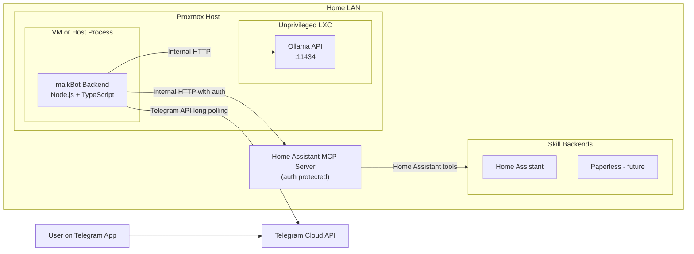
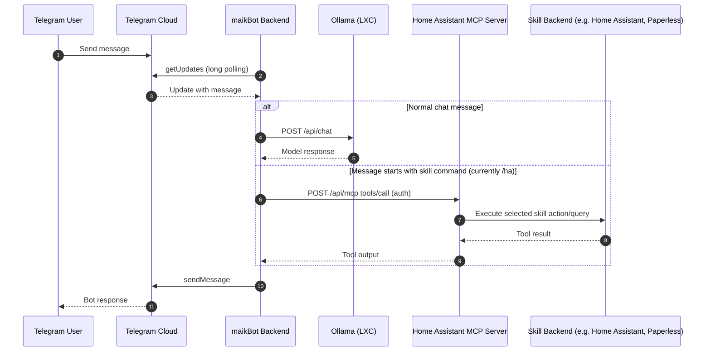

# maikBot

Local AI assistant with a security-first design:
- Telegram as chat channel via long polling (no open inbound port)
- Ollama in the local Proxmox/LXC network
- MCP as an optional multi-skill tool layer (currently Home Assistant, later e.g. Paperless)

## Target Architecture

Detailed architecture, rationale, interfaces, and diagrams:
- `docs/ARCHITECTURE.md`
- `docs/diagrams/deployment.mmd`
- `docs/diagrams/message-flow.mmd`

### Deployment Diagram

### Message Flow

## Security Principles

1. Do not expose Ollama directly to the internet.
2. Use Telegram long polling instead of Telegram webhooks.
3. Enable a Telegram user allowlist (`ALLOWED_TELEGRAM_USER_IDS`).
4. Use MCP only internally and only with API key/TLS.
5. Keep Proxmox/LXC firewalls on default-deny and allow only required flows.

## Repository Status

- `backend/`: fresh backend implementation from scratch (TypeScript)
- `backend/src/services/telegram-bot.service.ts`: long-polling bot
- `backend/src/services/ollama.service.ts`: Ollama client
- `backend/src/services/home-assistant-mcp.service.ts`: MCP connector (currently HA-focused naming)
- `backend/src/core/assistant.ts`: routes messages (currently `/ha ...` -> MCP)

## Quick Start

See `QUICKSTART.md`.
