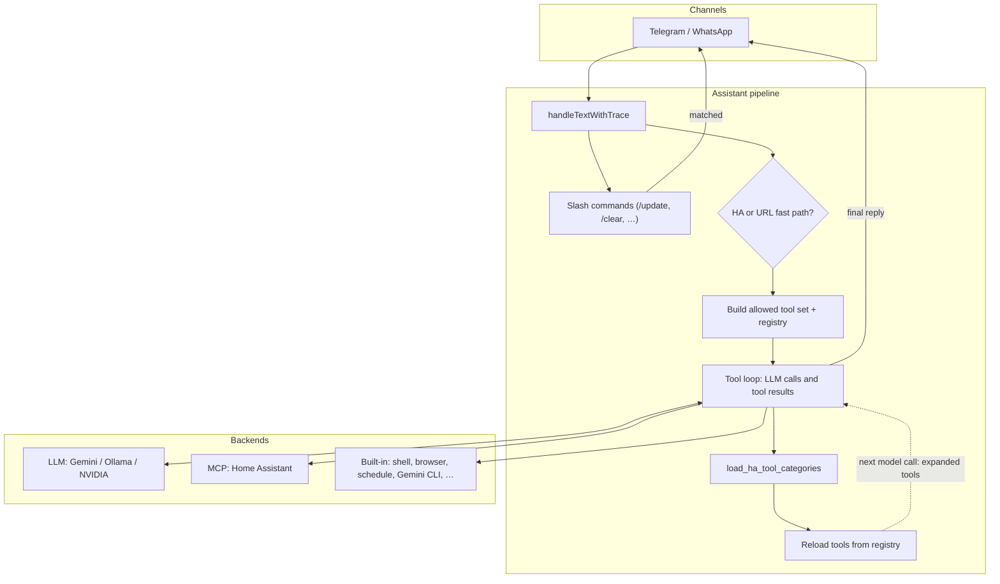

# maikBot

AI assistant via Telegram (and optional WhatsApp). LLM: Gemini, Ollama, or NVIDIA NIM. Tools: MCP (Home Assistant), shell, browser, scheduling.

## Architecture

High-level request flow: the channel layer forwards text to the assistant, which runs a **tool loop** against the configured LLM. **Home Assistant** capabilities are split into a **base** set (search, state, simple control) and **on-demand** categories; the model can call `load_ha_tool_categories` mid-turn to attach more `ha_*` MCP tools before the next iteration. Built-in tools (shell, Gemini CLI, browser, schedule, scan, …) are loaded according to the same allowlist. Slash commands such as `/update` are handled **before** the tool loop.

**Mermaid source file:** [`docs/diagrams/assistant-architecture.mmd`](docs/diagrams/assistant-architecture.mmd) (open in [Mermaid Live Editor](https://mermaid.live) or any Mermaid-compatible preview). The same diagram is embedded below for GitHub.



**Modes**

| Setting | Effect |
|---------|--------|
| Default | Base tools + HA search/control + `load_ha_tool_categories` for deeper HA (automation, dashboards, history, …). Fewer MCP tools in the schema until the model loads them. |
| `LLM_HA_FAST_PATH=true` | Short on/off-style phrases start with only HA **search** + **control**; the model can still call `load_ha_tool_categories` if it needs more. |

If an old `.env` still sets `LLM_SKIP_TRIAGE`, it is **ignored**; the backend logs a one-line deprecation warning at startup.

## Quick Start

```bash
cd backend
npm install
cp .env.example .env   # fill TELEGRAM_BOT_TOKEN, ALLOWED_TELEGRAM_USER_IDS, GEMINI_API_KEY
npm run dev
```

## systemd (Debian/Ubuntu VM)

For production with auto-restart (e.g. after `/update`):

```bash
sudo ./setup-systemd.sh --install
sudo systemctl start maikbot
```

Without `--install` the script only shows the service file. Logs: `journalctl -u maikbot -f`

## Commands

| Command | Description |
|---------|-------------|
| `/model` | Show current LLM |
| `/model gemini` \| `/model ollama` \| `/model nvidia` | Switch LLM |
| `/update` | Pull updates, build, restart (needs systemd/PM2) |
| `/reload` | Build and restart only (for Gemini CLI self-improvements, no git pull) |
| `/clear` | Reset chat |
| `/status` | Context stats |
| `/mcp tools` | List MCP tools |
| `/scan` | Scan document (see Scan → Paperless below) |

## Self-update & Self-improvement

Chat history is persisted to disk (`data/chat-sessions/`) and survives restarts.

**Natural language:** Ask the bot to update itself (e.g. "update dich", "aktualisiere dich") – it uses `shell_exec` for git pull, build, then tells you to run `/update` or restart.

**`/update`:** Full flow: persist chat, git pull, npm install, npm run build, exit. A process manager (systemd, PM2) restarts the bot.

**`/reload`:** Build and restart only – for local changes from Gemini CLI (avoids git pull overwriting edits).

**Self-improvement via Gemini CLI:** Ask the bot to improve itself (e.g. "verbessere dich: füge X hinzu"). It delegates to Gemini CLI with instructions to create a feature branch, make changes, commit, push, and open a PR. Never commits to main. After you merge the PR, run `/update`.

**Iterations:** When you ask to change a previous Gemini result (e.g. "change that to X"), the bot uses `continue_session=true` to resume the same Gemini CLI session.

## External repos (Git workspace)

When you ask the bot to work on an external repo (e.g. "clone X and add feature Y"), it clones into `data/repos/` and delegates to Gemini CLI with that workspace. Configure `GIT_REPOS_DIR` if needed (must be under `GEMINI_CLI_WORKSPACE_ROOT`).

## .env essentials

- `TELEGRAM_BOT_TOKEN` — @BotFather
- `ALLOWED_TELEGRAM_USER_IDS` — your Telegram ID
- `GEMINI_API_KEY` — [aistudio.google.com/apikey](https://aistudio.google.com/apikey) — or `OLLAMA_BASE_URL` for local Ollama — or `NVIDIA_API_KEY` for [NVIDIA NIM](https://build.nvidia.com)

See `backend/.env.example` for full options.

## Scan → Paperless

`/scan` works in **Telegram** and **WhatsApp**. It starts a scan from the printer (HP WebScan) or via SANE/scanimage. Multi-page scans are supported:

- **/scan** — scan a page (or the first page)
- **/scan** — add another page
- **/scan done** — finish: PDF preview, then confirmation
- **/scan cancel** — cancel the session

**Natural language:** Write "scanne am Drucker" or "scan document" to trigger a scan. For more pages: "noch eine Seite" or "weiter". To finish: "fertig" or "done".

**Telegram:** preview with inline buttons "Send to Paperless" / "Discard", or type "yes"/"no".
**WhatsApp:** preview sent as a document; reply with "yes" or "no".

**PDF upload:** send a PDF file (Telegram/WhatsApp) → the bot asks whether to send it to Paperless. Confirm with the button or “yes”.

Requirements: `SCAN_BACKEND=hp-webscan` + `SCAN_HP_PRINTER_IP`, or `SCAN_BACKEND=scanimage` (SANE/airscan). Paperless: `PAPERLESS_URL` + `PAPERLESS_TOKEN`.

## Paperless-ngx document classification

When `PAPERLESS_URL` and `PAPERLESS_TOKEN` are set, maikBot runs an HTTP webhook server that automatically classifies newly consumed documents (tags, correspondent, document type) using the LLM. Inspired by [Paperless-AI](https://github.com/clusterzx/paperless-ai).

1. Add to `.env`:
   ```
   PAPERLESS_URL=http://192.168.178.96:8000
   PAPERLESS_TOKEN=your_api_token
   PAPERLESS_CLASSIFY_PORT=3080
   ```

2. **Paperless integration** — choose one:

   **A) Post-consumption script (recommended):**

   - Script on the Paperless host: `scripts/paperless-post-consume.sh`
   - Set `MAIKBOT_URL` in the script (e.g. `http://192.168.178.40:3080`)
   - `chmod +x paperless-post-consume.sh`
   - **Docker:** in `docker-compose.yml`:
     ```yaml
     environment:
       POST_CONSUME_SCRIPT: /usr/src/paperless/scripts/paperless-post-consume.sh
     volumes:
       - ./paperless-post-consume.sh:/usr/src/paperless/scripts/paperless-post-consume.sh:ro
     ```

   **B) Workflow webhook (Paperless 2.14+):** placeholders such as `{doc_url}` are not expanded in some versions. If the script approach is not possible:
   - Administration → Workflows → new workflow
   - Trigger: “Document added”, action: Webhook
   - URL: `http://<maikbot-host>:3080/api/paperless-classify?doc_url={doc_url}` (or body with `doc_url`)
