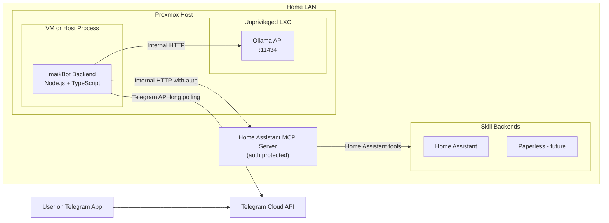
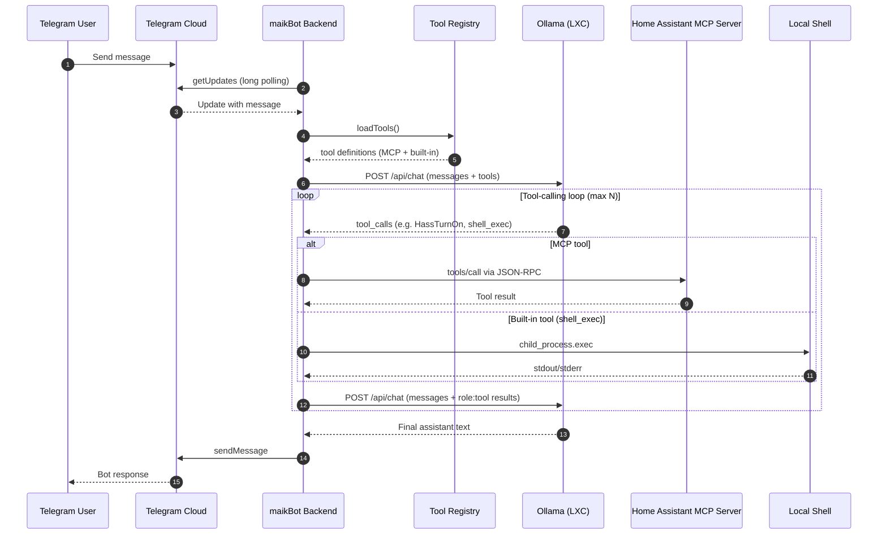

# maikBot

Local AI assistant with a security-first design:
- Telegram as chat channel via long polling (no open inbound port)
- Ollama in the local Proxmox/LXC network
- MCP as an optional multi-skill tool layer (currently Home Assistant, later e.g. Paperless)

## Target Architecture

Detailed architecture, rationale, interfaces, and diagrams:
- `docs/ARCHITECTURE.md`
- `docs/diagrams/deployment.mmd`
- `docs/diagrams/message-flow.mmd`

### Deployment Diagram

### Message Flow (Native Tool Calling)

## Security Principles

1. Do not expose Ollama directly to the internet.
2. Use Telegram long polling instead of Telegram webhooks.
3. Enable a Telegram user allowlist (`ALLOWED_TELEGRAM_USER_IDS`).
4. Use MCP only internally and only with API key/TLS.
5. Keep Proxmox/LXC firewalls on default-deny and allow only required flows.

## Tool Calling Architecture

maikBot uses **native Ollama tool calling** (similar to OpenClaw/NanoClaw):
- The model receives MCP tools + built-in tools as structured `tools[]` definitions (not prompt text).
- The model decides autonomously whether to call tools or respond directly.
- Tool calls are executed by the backend (MCP for Home Assistant, `child_process` for shell), results are fed back as `role:"tool"` messages.
- The model can chain multiple tool calls per user message (up to `OLLAMA_MAX_TOOL_CALLS`).
- If a tool fails, the model sees the error and can retry or explain.

### Available tool types
- **MCP tools**: any tool exposed by configured MCP servers (e.g. Home Assistant: `HassTurnOn`, `HassTurnOff`, `GetLiveContext`, etc.)
- **Built-in tools**: `shell_exec` — runs arbitrary shell commands on the backend host

### Key files
- `backend/src/core/tool-registry.ts`: unified registry merging MCP + built-in tools
- `backend/src/core/tools/shell.ts`: shell_exec implementation
- `backend/src/core/assistant.ts`: tool-calling loop orchestrator
- `backend/src/services/ollama.service.ts`: Ollama client with native tool-calling support

## Quick Start

See `QUICKSTART.md`.
